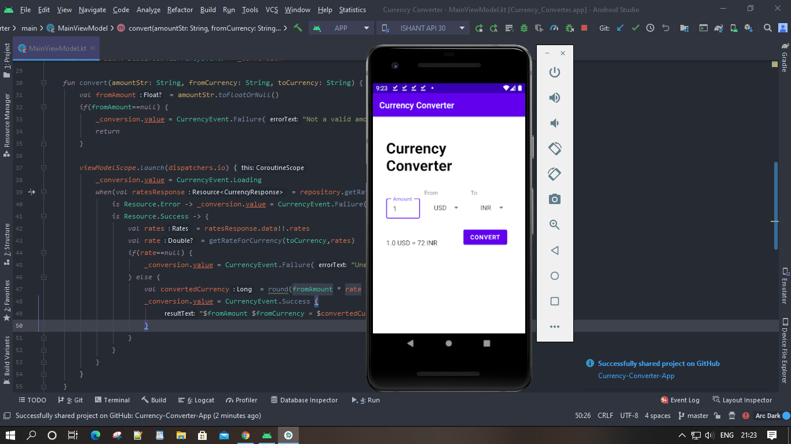

# Currency-Converter-App
This is a kotlin based android app that uses an API to convert a currency in one format to another. This app offers realtime currency conversion! The technologies I have used in this app are: Retrofit, StateFlows, MVVM and Dagger Hilt!

